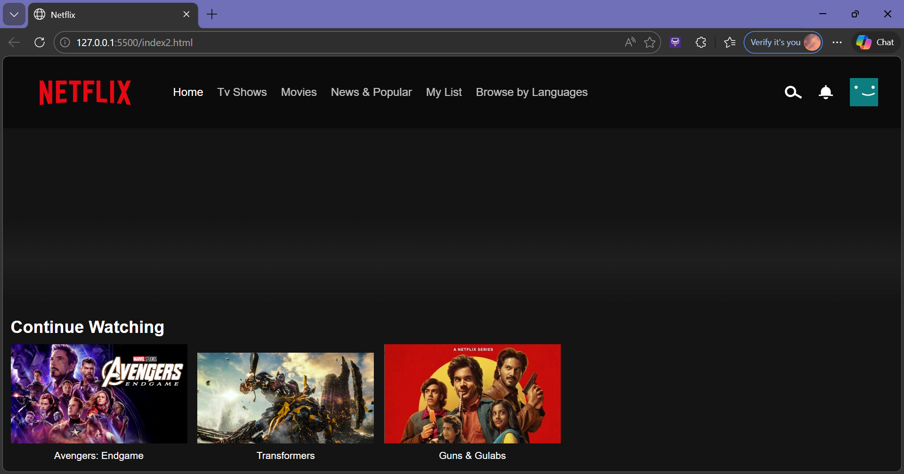
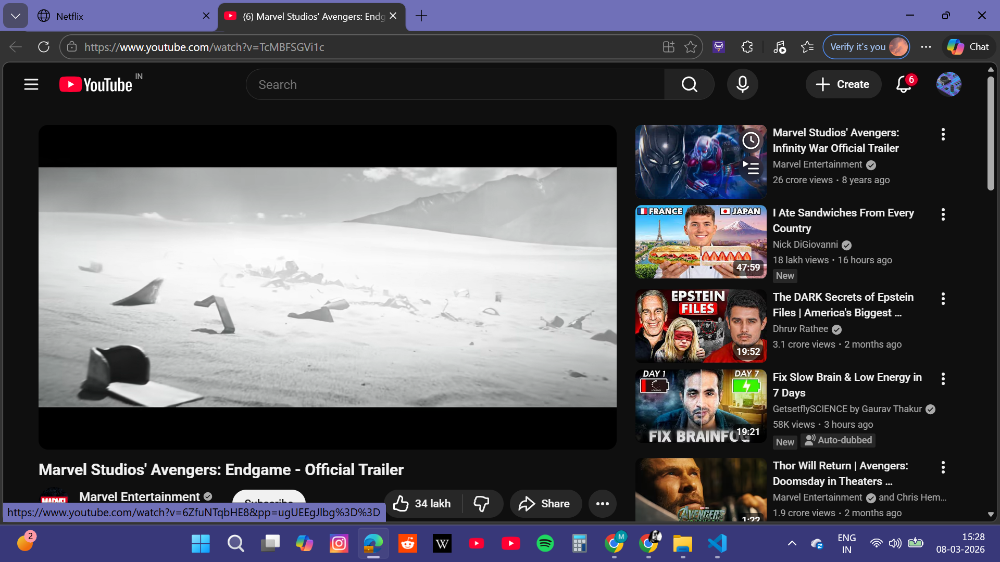
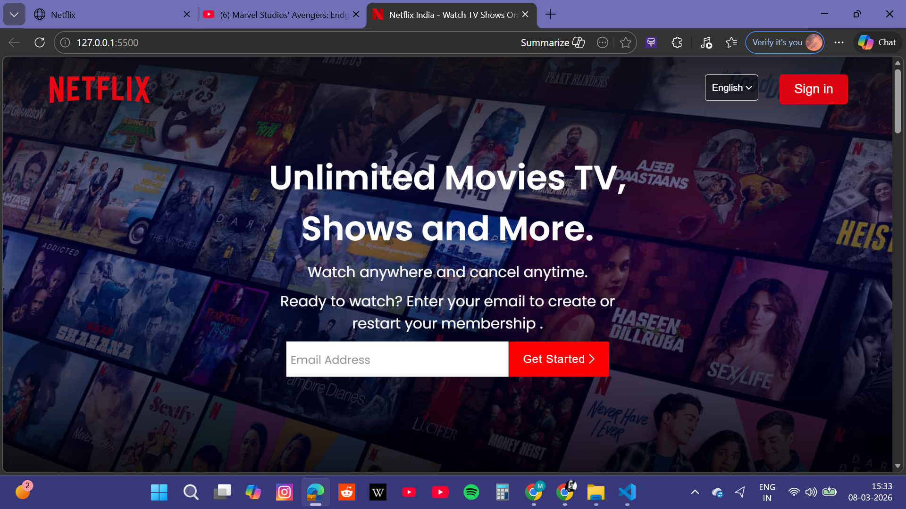

# 🎬 Netflix UI Clone


A **Netflix-inspired UI clone** built using **HTML, CSS, and JavaScript** that replicates the look and feel of Netflix's interface, including a landing page, movie browsing interface, and trailer playback integration.

This project was developed as part of my **5th Semester Web Technology Project at Manipal University Jaipur**.

---

# 📌 Project Overview

The objective of this project was to recreate the **user interface of a real-world streaming platform** like Netflix to understand modern **frontend development, responsive design, and UI/UX structure**.

The application includes:

* Netflix-style landing page
* Navigation bar with categories
* Continue watching section
* Movie thumbnails
* Trailer playback via YouTube
* Netflix inspired UI/UX

---

# 🚀 Features

✔ Netflix Landing Page UI
✔ Movie & TV Show Layout
✔ Continue Watching Section
✔ Embedded YouTube Trailer Playback
✔ Responsive Navigation Bar
✔ Netflix Inspired Dark Theme
✔ Interactive Buttons and UI Components

---

# 🛠️ Tech Stack

### Frontend

* HTML5
* CSS3
* JavaScript

### Tools Used

* VS Code
* Live Server
* Git
* GitHub

---

# 📂 Project Structure

```
Netflix-UI-Clone/
│
├── index.html
├── index2.html
├── style.css
├── script.js
│
├── assets/
│   ├── images
│   └── icons
│
└── screenshots/
    ├── landing.png
    ├── trailer.png
    └── home.png
```

---

# 🖼️ Screenshots

## Landing Page



---

## Trailer Playback (YouTube Integration)



---

## Netflix Style Home Interface



---

# ▶️ How to Run the Project

### 1️⃣ Clone the Repository

```
git clone https://github.com/tanishipss/netflix-ui-clone.git
```

### 2️⃣ Navigate to the Project Folder

```
cd netflix-ui-clone
```

### 3️⃣ Run the Project

Open **index.html** in your browser.

OR run it using **Live Server in VS Code**:

```
Right Click → Open with Live Server
```

The project will run locally at:

```
http://127.0.0.1:5500/
```

---

# 🌐 Deploy on GitHub Pages (Live Demo)

You can deploy the project for free using **GitHub Pages**.

### Steps

1. Go to your repository
2. Click **Settings**
3. Click **Pages**
4. Select:

```
Branch: main
Folder: /root
```

5. Save

Your project will be live at:

```
https://tanishipss.github.io/netflix-ui-clone/
```

---

# 📚 Learning Outcomes

Through this project I learned:

* Real-world UI cloning
* Responsive design techniques
* Structuring frontend projects
* Integrating external media (YouTube)
* CSS layout and styling
* Git & GitHub workflow

---

# 🎓 Academic Information

**Course:** Web Technology
**Semester:** 5th Semester
**University:** Manipal University Jaipur

This project was developed as part of my academic coursework to demonstrate frontend web development skills.

---

# ⚠️ Disclaimer

This project is created **for educational purposes only**.

All trademarks and media content belong to **Netflix and their respective owners**.

---

# 👩‍💻 Author

**Tanisha Yadav**

🎓 B.Tech Student – Manipal University Jaipur
💻 Interested in Machine Learning, AI, and Web Development

GitHub Profile:
https://github.com/tanishipss
